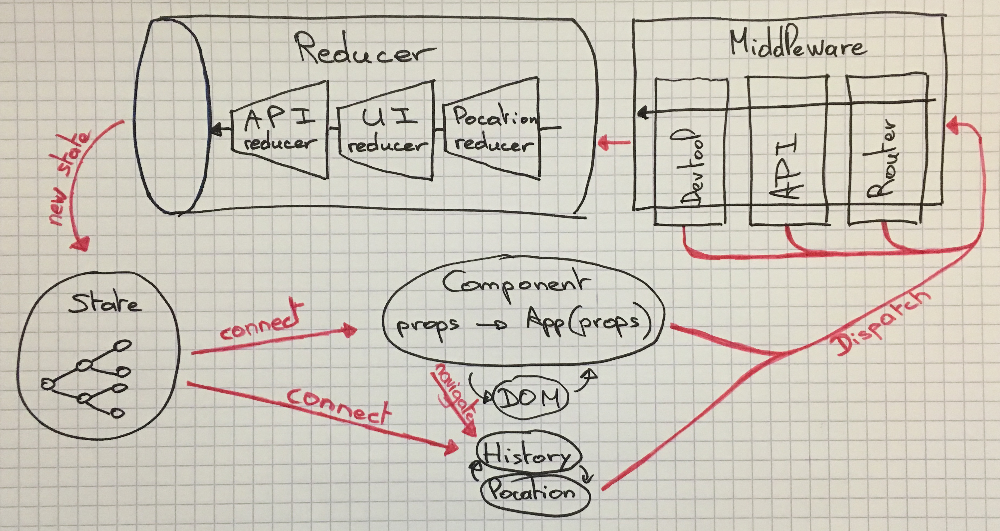
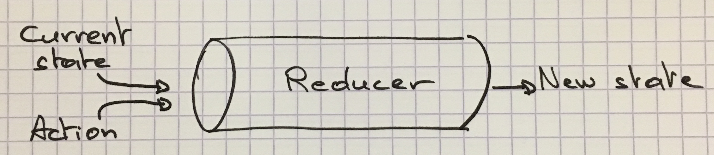
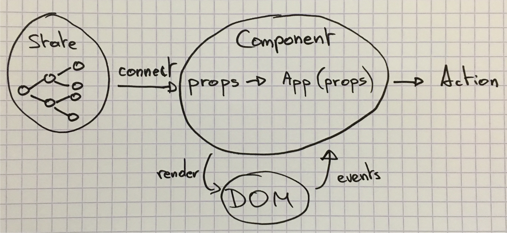
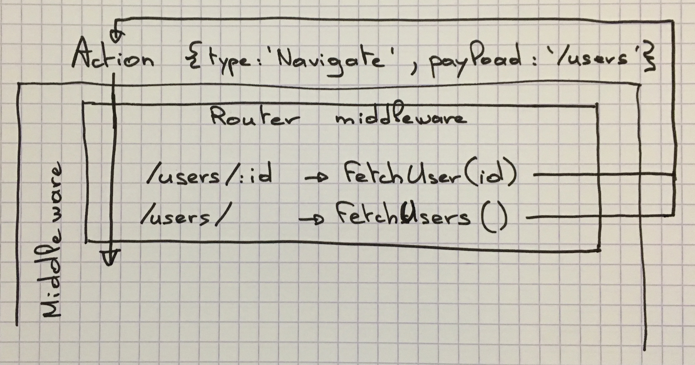

# APP-CATALOG

## Architecture



## Redux - Store




```JavaScript
import {createStore} from 'redux';

const reducer = (state, action) => {
  switch (action.type) {
    case 'INCREMENT':
      return state + 1;
    case 'DECREMENT':
      return state - 1;
    default:
      return state;
  }
};

const store = createStore(reducer, 0);

store.getState(); // 0
store.dispatch({type: 'INCREMENT'});
store.getState(); // 1
store.dispatch({type: 'DECREMENT'});
store.getState(); // 0
```

### Action : [Flux Standard Actions](https://github.com/acdlite/flux-standard-action)

An action describes an **intent** to change state.

- *Human-friendly*: FSA actions should be easy to read and write by humans.
- *Useful*: FSA actions should enable the creation of useful tools and abstractions.
- *Simple*: FSA should be simple, straightforward, and flexible in its design.

```JSON
{
  "type": "ADD_TODO",
  "payload": {
    "text": "Do something."
  }
}
```

```JSON
{
  "type": "ADD_TODO",
  "payload": "error",
  "error": true
}
```

[Example WWW-STATIC](https://www-static.coorpacademy.com/catalog/trainings)

## Reducer


A special function that **knows** how every action transforms the entire application's state.

- **Pure function**
- split the root reducer into **smaller reducers**

```JavaScript
import {createStore, combineReducers} from 'redux';

const todos = (state = [], action) => {
  switch (action.type) {
    case 'ADD_TODO':
      return state.concat([action.text]);
    default:
      return state;
  }
};

const counter = (state = 0, action) => {
  switch (action.type) {
    case 'INCREMENT':
      return state + 1;
    case 'DECREMENT':
      return state - 1;
    default:
      return state;
  }
};

const reducer = combineReducers({
  todos,
  counter
});

const store = createStore(reducer);
store.getState();
// {
//   counter: 0,
//   todos: []
// }
store.dispatch({
  type: 'ADD_TODO',
  text: 'Use Redux'
});
store.getState();
// {
//   counter: 0,
//   todos: [ 'Use Redux' ]
// }
```

[Example APP-CATALOG](https://github.com/CoorpAcademy/app-catalog/tree/master/src/reducers)

[Example WWW-STATIC](https://www-static.coorpacademy.com/catalog/trainings)

## Components



- Produces *pure* components
- *Logic-less*
- *HMR*

```JavaScript
const CountView = props => (
  <span onClick={props.onIncrement}>+</span>
  <span onClick={props.onDecrement}>-</span>
  <span>{props.value}</span>
);

const connect = state => ({
  value: state,
  onIncrement: () => store.dispatch({type: 'INCREMENT'}),
  onDecrement: () => store.dispatch({type: 'DECREMENT'})
});

store.listen(
  state => update(
    CountView( connect(state) )
  )
);
```

[Demo Component-Sandbox](http://localhost:3004/Snabbdom/atom/star/disable)

## Redux - Middleware

It provides a third-party extension point between dispatching an action, and the moment it reaches the reducer.

People use Redux middleware for **logging**, **crash reporting**, **talking to an asynchronous API**, **routing**, and more.

```JavaScript
const logger = store => next => action => {
  console.log('prev state', store.getState());
  console.info('dispatching', action);
  const result = next(action);
  console.log('next state', store.getState());
  return result;
}
```

```JavaScript
const vanillaPromise = store => next => action => {
  if (typeof action.then !== 'function')
    return next(action);

  return Promise.resolve(action).then(store.dispatch);
};
```

```JavaScript
import {createStore, applyMiddleware} from 'redux';

const store = createStore(
  reducer,
  applyMiddleware(
    vanillaPromise,
    logger
  )
);

store.dispatch(action); // action
store.dispatch(Promise.resolve(action)); // Promise { <pending> }
```
[Example WWW-STATIC](https://www-static.coorpacademy.com/catalog/trainings)

## [Redux-api-middleware](https://github.com/agraboso/redux-api-middleware)

```JavaScript
import { CALL_API } from `redux-api-middleware`;

const fetchUser = {
  [CALL_API]: {
    endpoint: 'http://www.example.com/api/users',
    method: 'GET',
    types: ['REQUEST', 'SUCCESS', 'FAILURE']
  }
}

store.dispatch(fetchUser) // Promise { <pending> }
.then(
  action => {} // {type: 'SUCCESS', ...}
);
```

```JSON
{
  "type": "REQUEST"
}
```

```JSON
{
  "type": "SUCCESS",
  "payload": {
    "users": [
      { "id": 1, "name": "John Doe" },
      { "id": 2, "name": "Jane Doe" },
    ]
  }
}
```

```JSON
{
  "type": "FAILURE",
  "payload": "error",
  "error": true
}
```

[Example WWW-STATIC](https://www-static.coorpacademy.com/catalog/trainings)

### Defining the API call

```JavaScript
{
  [CALL_API]: {
    endpoint: 'http://www.example.com/api/users',
    method: 'POST',
    body: user,
    headers: {token},
    bailout: state => !!state.users,
    types: [{
      type: 'REQUEST',
      payload: (action, state) => ({})
      meta
    }, {
      type: 'SUCESS',
      payload: (action, state, res) => res.json()
      meta
    }, {
      type: 'FAILURE',
      payload
      meta: (action, state, res) => ({status: res.status})
    }]
  }
}
```

## Router middleware



## [normalizr](https://github.com/paularmstrong/normalizr)

Normalizes deeply nested JSON API responses according to a schema

```JSON
[{
  "id": 1,
  "title": "Some Article",
  "author": {
    "id": 1,
    "name": "Dan"
  }
}, {
  "id": 2,
  "title": "Other Article",
  "author": {
    "id": 1,
    "name": "Dan"
  }
}]
```

```JSON
{
  "result": [1, 2],
  "entities": {
    "articles": {
      "1": {
        "id": 1,
        "title": "Some Article",
        "author": 1
      },
      "2": {
        "id": 2,
        "title": "Other Article",
        "author": 1
      }
    },
    "users": {
      "1": {
        "id": 1,
        "name": "Dan"
      }
    }
  }
}
```

[Example WWW-STATIC](https://www-static.coorpacademy.com/catalog/trainings)

# Q&A


# :clap:
